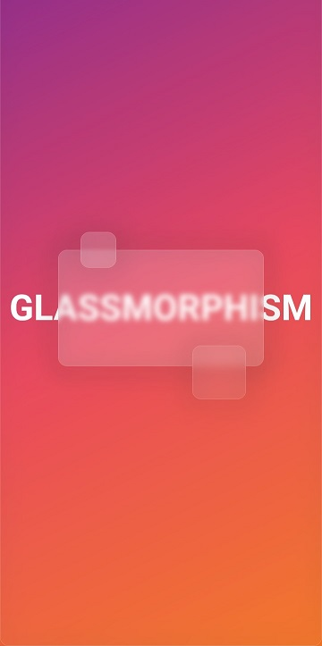

# glassmorphism_ui 

Create glassmorphic design using GlassContainer having frosted glass effect.

----------
## Getting Started

Create beautiful glassmorphic designs using this package,GlassContainer Widget provided by this package is completely customizable,change Container's opacity,blur,border,radius etc.




### GlassContainer

```dart
GlassContainer(
  height: 200,
  width: 200,
  blur: 4,
  color: Colors.white.withOpacity(0.1),
  gradient: LinearGradient(
    begin: Alignment.topLeft,
    end: Alignment.bottomRight,
    colors: [
      Colors.white.withOpacity(0.2),
      Colors.blue.withOpacity(0.3),
    ],
  ),
  //--code to remove border
  border: Border.fromBorderSide(BorderSide.none),
  shadowStrength: 5,
  shape: BoxShape.circle,
  borderRadius: BorderRadius.circular(16),
  shadowColor: Colors.white.withOpacity(0.24),
),
```

### GlassImage

Image with frosted glass overlay

```dart
GlassImage(
  height: 200,
  width: 200,
  blur: 4,
  image: Image.network(
    "link",
    fit: BoxFit.cover,
  ),
  overlayColor: Colors.white.withOpacity(0.1),
  gradient: LinearGradient(
    begin: Alignment.topLeft,
    end: Alignment.bottomRight,
    colors: [
      Colors.white.withOpacity(0.2),
      Colors.blue.withOpacity(0.3),
    ],
  ),
  border: Border.fromBorderSide(BorderSide.none),
  shadowStrength: 5,
  borderRadius: BorderRadius.circular(16),
  shadowColor: Colors.white.withOpacity(0.24),
),
```

If you just want to blur image use `BlurredImage` widget

```dart
ClipRect(
  child: BlurredImage(
  image: Image.network(
      "link",
      fit: BoxFit.cover,
    ),
  ),
),
```

Or use extension method

```dart
Image.network(
  "https://cdn.pixabay.com/photo/2015/04/23/22/00/tree-736885__480.jpg",
  fit: BoxFit.cover,
).blur(blur: 4),

// Clip blur area
Image.network(
  "https://cdn.pixabay.com/photo/2015/04/23/22/00/tree-736885__480.jpg",
  fit: BoxFit.cover,
).blurClipped(blur: 4),
```

### Blur 

Widget that blur only it's child.

```dart
Blur(blur: 4, child: Text("Glassmorphism")),

//extension method
Text("Glassmorphism").blur(blur: 4),
```
